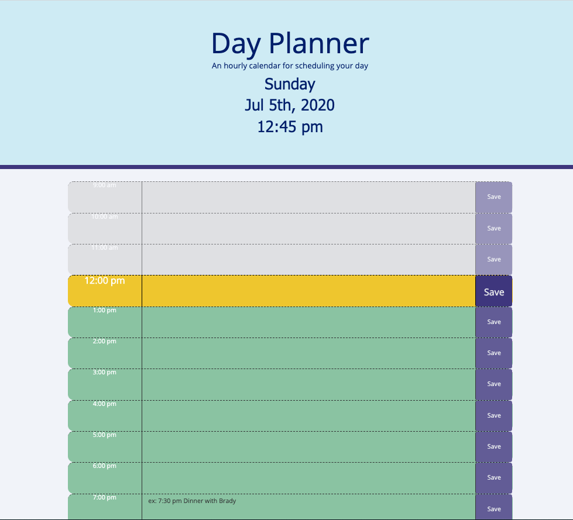

# Day Planner

# Purpose

A simple calendar application that allows the user to save events for each hour of the day. 

## How to Use
To enter a new event, click on the blank text box directly to the right of the relevant time block. When done typing, click the Save button directly to the right of the text box. 

## Link
https://nikcastle.github.io/day-planner/

## Images

## Credits
This app was created using an API from Moment.js; as well as making use of Google fonts and Bootstrap CSS. 

